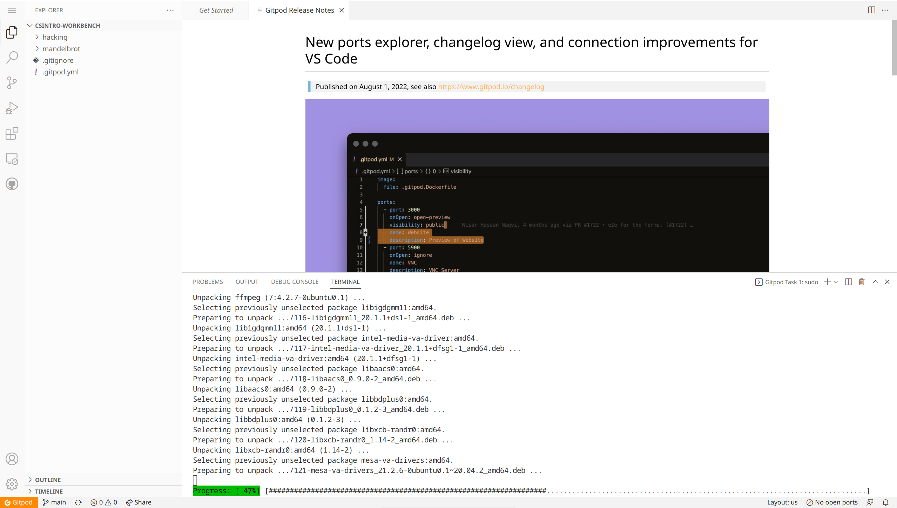

 

## 环境要求

能运行任意现代浏览器的接入互联网的设备，包括但不限于：
1. 安卓/ios 手机/平板
2. X86_64 或 AArch64(ARM64) 的 Windows/Linux/MacOS
3. 装有 Linux 操作系统的 PlayStation4
4. Steam Deck
5. 树莓派

但是为了得到一个良好的学习体验，请尽量选择 X86_64 的 Windows/Linux/MacOS

## GitHub 注册

GitHub 是如今世界上最大的代码托管仓库和开源社区，在今后的学习过程中，你将逐渐意识到它的优点。





## 使用 GitPod

访问 [gitpod.io](https://gitpod.io/)，使用 GitHub 登录。

点击 New Workspace 并输入 `https://github.com/Bubbleioa/csintro-workbench.git`

当下面的 Progress 进行完毕之后，你就完成了本课所有环境的搭建。

之后会有进阶内容的补充，不过理论上只用 GitPod 就能完成所有的课程。

GitPod 免费版每人每月有 50 个小时的使用时间，这对我们来说绰绰有余，**但是别忘记结束使用的时候先回到主页，停止刚刚的工作区。**
